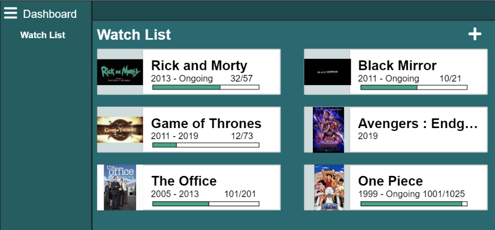

# Main Documentation: Intro to the Binge Tracker

This document introduces go through all files inside sources directory in our github repo and explain their purposes and functionalities. 

## [CI/CD Pipeline](https://cse110-fa22-group9.github.io/Team9Repository/admin/cipipeline/phase1.html)

## [JSDoc](https://cse110-fa22-group9.github.io/Team9Repository/JSDoc/index.html)

## Source Files 
Here is the overview of the hierarchy of all files in the source directory: \
(Click on each of it to see the decription of files and each function inside the file)

- src/
  - _test_/ \
 *(all testing files: each file include unit tests to the corresponding javascipt files)*
    - [addContent.test.js](#addContenttestjs)
    - [smallCard.test.js](#smallcardtestjs)
    - [smallMovieCard-unit.test.js](#smallmoviecard-unittestjs)
    - [smallShowCard-unit.test.js](#smallshowcard-unittestjs)
    - [tools-unit.test.js](#tools-unittestjs)
  - assets/
    - img/ \
    *(store all images in our project including beinge tracker's logo, images for ratings, and images for edit, delete, and home icons)*
    - pages/ *(design for all webpages)*
      - [add-content.html](#add-contenthtml)
      - [movie-show-subpage.html](#movie-show-subpagehtml)
      - [TestCard.html](#TestCardhtml)
    - scripts/ *(coding files)*
      - [addContent.js](#addcontentjs)
      - [expandedMovieCard.js](#expandedmoviecardjs)
      - [expandedShowCard.js](#expandedshowcardjs)
      - [jestLocalSotrage.js](#jestlocalsotragejs)
      - [main.js](#mainjs)
      - [movie-show-subpage.js](#movie-show-subpagejs)
      - [smallMovieCard.js](#smallmoviecardjs)
      - [smallShowCard.js](#smallshowcardjs)
      - [tools.js](#toolsjs)
  - docs/
    - [CardObjects.md](#CardObjectsmd)
  - [index.html](#indexhtml) *(design for the homepage)*

## Files Description

### Testing
#### addContent.test.js
#### smallCard.test.js
#### smallMovieCard-unit.test.js
#### smallShowCard-unit.test.js
#### tools-unit.test.js
#### expandedMovieCard.test.js
This file consists of E2E tests for every every functionality in the expandedMoviecard.js and tests to esnure that all data shows gets stored in local storage properly and that all data shows up properly on the webpage as well. I
[return to the Source Files](#Source-Files)

### Page Designs
#### add-content.html
The file consists of both css and html codes for the "add content" subpages. There are three main html conponents: movie/show selections page, add movie page, and add show page. Choosing movie or show in the selection page will display the corresponding html codes. 
#### movie-show-subpage.html
The file movie-show-subpage imports corresponding javascript files (expandedMovieCard, expandedShowcard, movie-show-subpage) which implement inner html and inner css for this page.
#### TestCard.html
[return to the overview](#Source-Files)

### Scripts 
#### addContent.js
Add Content is our handler for addContent.html and for our editing system. Add content looks for if there is an incoming ID it should load, or if this is a completely new creation. Then based on which form is selected, it will create a show or movie as long as none of the information is unexpected or bad data. 
#### expandedMovieCard.js
The file contains both inner html, css, and javascripts for designing and styling of the expanded movie card when click on the movie's name. The expanded movie card include rating, comments, and movable progress bar to keep track of how much we have already watched.  
#### expandedShowCard.js
The file contains both inner html, css, and javascripts for designing and styling of the expanded show card when click on the show's name. The expanded show card include rating, comments, and clickable check boxes for each episode to track the number of expisodes watched. 
#### jestLocalStorage.js
Document that houses the localStorage used by Jest, for the sake of proper unit testing of functions that use localStorage.
#### main.js
Document that get all the data from localStorage and create small show or movie card base on the data.
#### movie-show-subpage.js
Document that starts the function calls to generate the expanded cards
#### smallMovieCard.js
The file contains both inner html, css, and javascripts for designing and styling of the small movie cards that appear on the home page. The small movie card displays the show title and image, the rating, and how much progress the user has made into the show.  
#### smallShowCard.js
The file contains both inner html, css, and javascripts for designing and styling of the small show cards that appear on the home page. The small show card displays the show title and image, the rating, and how much progress the user has made into the show.  
#### tools.js
The file contains commonly used functions for loading, saving and getting the id of an element from local storage.  Main purpose of this file to to prevent redundent code bloat in other files
[return to the overview](#Source-Files)

#### index.html
This file contains both css and html codes for the main page, which established links to subpages and expanded movie card. The code also organize the layout for small movie cards. 
[return to the overview](#Source-Files)


## Data Storage
All functions should be written in `tools.js`.

All the movie information are stored as value of key `shows` in localstorage. The following functions are required for data operations:
### Getter: `getShowsFromStorage()`
- Input: None;
- Output: The array contains all movie information that are stored as value of key `shows` in localstorage;
- Modification: None;
### Setter: `saveShowsToStorage()`
- Input: An array contains all movie information that want to be stored as value of key `shows` in localstorage;
- Output: None;
- Modification: update the localstorage.
### Structure of `show`
We define the element in the the array contains all movie information that are stored as value of key `shows` in localstorage as `show`. Each show should have following key-value pairs:
- "title": `String`; This should be **unique**.
- "imgSrc": `String`
- "imgAlt": `String`
- "movie": `boolean`; `True` means this is a movie.
- "movieDuration": `Integer`; `1` means movie is 1 minute long. 
- "movieHasWatched": `Integer`; `1` means the movie has already been watched for the first 1 minute. 
- "showNumEpisodes": `Integer`; `1` means the show has total of 1 episode.
- "showEpisodesWatched": `Array of Integer`: `[1,10]` means the episodes 1 and 10 has been watched.
- "rating": `Integer`; 
- "comments": `String`

We assume all the attributes are valid for each `show`. Validation check should be formed before adding new `show`. 

## Main Page: `index.html`
Files that are modified: `main.js`, `index.html`, 

Optional: `form.html`, `form.js`, `detail.html`, `detail.js`

### Navigate Bar
- Design and implement the navigate bar with following links:
  - Watch List: A linkage to watch list page.
### Add button
- Design and implement the add button for adding the show. Folling concerns should be considered before implementing:
  - Since we want to use "form" to make the user add data to our application, should we create another page called `form.html` that specifically built for this purpose or should we hide such form in `index.html` and appears only needed? What's the operation we need to perform after user submitted the form?
### Form: Add new `show` to our application. 
- Create a form that could matched the above attributes.
  - Think about how to seperate movie from show. 
The form should have one function connected to it, called `updateShows()`:
- Input: user inputs in the form
- Output: None
- Modification: updating the local storage by calling `getShowsFromStorage()` and `saveShowsToStorage()`.

Note: Data verification need to be performed in this function to ensure all attributes are valid.
### Display section
- Design and implement the display section for showwing small cards.(Mostly CSS since there would be no concrete HTML code. All the HTML elements in the wrapper are generated by the following functions.)

The javascipt code should looks like somthing as following:
```
window.addEventListener('TODO', init);

function init() {
  TODO
}
```
Note: If we want to integrate the form we mentioned above into `index.html`, then a `formhandler()` function should also be included somewhere in the js code.

In this initialization function, we should get the data from local storage and then using such data to create small cards. The operation is suggested to be wrapped as following function, `addSmallCards()`
- Input: `shows` from local storage(If we get `shows` outside of the function, otherwise, it should be none)
- Output: None
- Modifications: add bunch of small cards into out `index.html`.

Note: There are various ways to implement the above function. But the easiest way to do so is to create a new class of `HTMLElement` called `smallCard`. The implementation could refer to lab6 and lab7 and define an element called `smallCard` from this class. Then we could simply create bunch of `smallcard`s in `addSmallCards()`. 

### Showing Expanded Card
Similarly, we are going to implement a function called `addExpandedCard()`. However, the detail is not discussed well and there are two possible ways for implementation.

#### Method 1: New page.
We need a new page called `detail.html`.

Step1. Design and implement all the html and css code outside the wrapper. The wrapper is where we would insert the expanded card.

Step2. Modify the innerHTML of `smallCard`.(For example, make the some DOM as a link to the `detail.html`). And when the user click the small card, add an indicator in local storage so we know which show the user want to see in detail. 

Step3. Like what we did for `smallCards`, we insert a desired expanded card into the wrapper in `detail.html`.

#### Method 2: Stay in the same page.
Instead of creating a new page, we could also simply insert the expanded card write below the small cards. 

## Anchoring
The anchoring between two website is base on the index.
Inside the smallShowCard and smallMovieCard class it will link to it's corresponding subpage and editpage. The way to achive this is to use index add a parameter into link.

### addContent.html example: 
if the link is ./assets/pages/add-content.html?ind=0 Then the index for the movie or show we want edit is 0. Then at addContent.js will use URLSearchParams(queryString) to get the parameter ind = 0 and know what it is calling from the the movie or show card index 0. 

### movie-show-subpage.html example: 
if the link is ./assets/pages/movie-show-subpage.html?ind=0 Then the index for the movie or show we want edit is 0. Then at movie-show-subpage.js will use URLSearchParams(queryString) to get the parameter ind = 0 and know what it is calling from the the movie or show card index 0. Then it will generate the corresponding expandshow or expandmovie card to movie-show-subpage.


