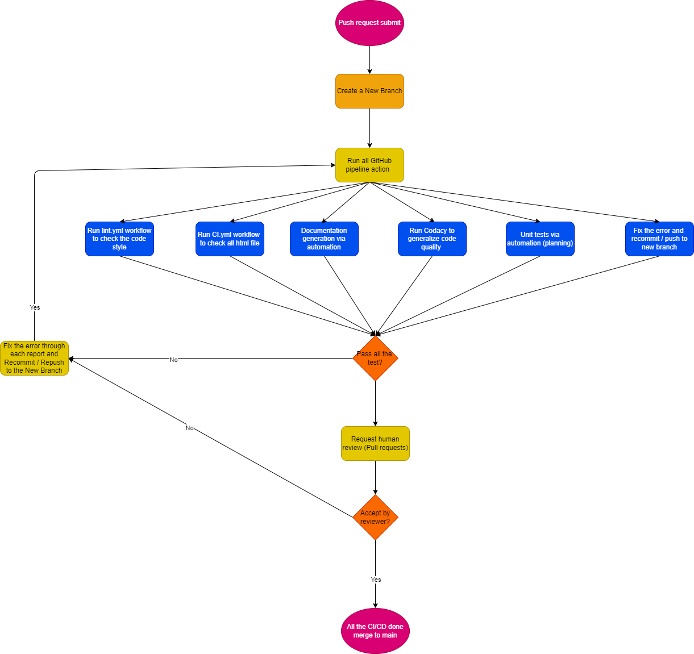

[Demonstration of the pipeline](./phase1.mp4)

Things already implemented
  - linting and code style enforcement (lint.yml)
    - Check at github action called Lint Code Base
    - Using super-linter to check all the code style inside the src file
  - Code quality via tool 
    - Using Codacy to check the code quality
    - Can check it at [Codacy](https://app.codacy.com/gh/cse110-fa22-group9/Team9Repository/dashboard )
    - Check the code style and bug
  - code quality via human review
    - Created at Github branches
    - Add the protection rules for main branch
    - Every merge request to branch need review and approved by another teammate in Team9
  - HTMLCheck.yml
    - Check the code quality for html file's at github action called HTMLCheck

  - unit test via automation (test.yml)
    - smallCard.test.js. Thistest file is used to E2E test the correctness of the small show and movie card. It will first clear and insert 3 movie data and 3 show data to the localstorge. Dring the testing, it will test serverl things to make sure the small movie and show card is create by main.js, smallMoviecard.js, and smallShowcard.js correctly to the main.html.
      - before the test: clean the local storge
      - test 1: Add all the data to local storge (should always pass)
      - test 2: Check to make sure that all <small-movie-card> elements have loaded
      - test 3Check to make sure that all <small-show-card> elements have loaded
      - test 4: Check to make sure that all <small-movie-card> elements have data in them
      - test 5:Check to make sure that all <small-show-card> elements have data in them
      - test 6: Make sure all the <small-movie-card> elements have correct link to thier expandedMovie page
      - test 7:Make sure all the <small-show-card> elements have correct link to thier expandedShow page
      - test 8: Make sure all the <small-movie-card> elements have correct link to thier expandedMovie page
      - test 9: Make sure all the <small-show-card> elements have correct link to thier edit page
      - test 10: clean the local storge after test is done(should always pass)
    - addContent.test.js -- This file E2E tests the add-content feature, to check whether shows and movies added by a user via the form are properly saved into localStorage.
    - tools-unit.test.js -- This file unit tests each function in tools.js, all of which are functions that directly deal with localStorage. This file tests whether content is properly saved to localStorage, whether content is successfully retrievable from localStorage, and whether the ID is properly updated.
    - smallMovieCard-unit.test.js This test file is used to unit test the correctness of the smallMovieCard.js class. It will create an movieCard Object and sent the data in and out for that object to test if the set data() and get data() function working correctly.
      - setData() and get data() test 1 - 5: set different data to the movieCard Object and see if the data out is correct
    - smallShowCard-unit.test.js This test file is used to unit test the correctness of the smallShowCard.js class. It will create an showCard Object and sent the data in and out for that object to test if the set data() and get data. It will also test the correctness of the function totalepisodeNum() and episodesWatched().
      - totalepisodeNum() test 1 - 5: input different 2D array and see if the output is the total number of length for that 2D array
      - episodesWatched() test 1 - 5: input different 2D array and see if the output is the total number of true value inside the 2D array
      - setData() and get data() test 1 - 5: set different data to the movieCard Object and see if the data out is correct
      - expandedMovieCard-unit.test.js This files tests every function in expandedMovieCard.js and ensures it spits the correct output given test input
      - expandedShowCard-unit.test.js This files tests every function in expandedMovieCard.js and ensures it spits the correct output given test input
      - expandedMovieCard.test.js This test file is used to E2E test the correctness of the expanded movie card. It will first clear and insert 3 movie data to the localstorge. Dring the testing, it will test serveral things to make sure the expanded movie is create by main.js and expandedMoviecard.js correctly to the main.html.
           - before the test: clean the local storge
      - test 1: Add all the data to local storge (should always pass)
      - test 2: Check to make sure that all <expanded-movie-card> elements have loaded
      - test 3: Check to make sure that all <expanded-movie-card> elements have data in them
      - test 4: Make sure all the <expanded-movie-card> elements have correct link to thier home page when the home button is clicked
      - test 5: Make sure all the <expanded-movie-card> elements have correct link to thier edit page when the edit button is clicked
      - test 6: Make sure all the <expanded-movie-card> elements can get deleted correctly when the delete button is clicked
      - test 7: clean the local storge after test is done(should always pass)
        - expandedShowCard.test.js This test file is used to E2E test the correctness of the expanded show card. It will first clear and insert 3 show data to the localstorge. Dring the testing, it will test serveral things to make sure the expanded show is create by main.js and expandedShowcard.js correctly to the main.html.
           - before the test: clean the local storge
      - test 1: Add all the data to local storge (should always pass)
      - test 2: Check to make sure that all <expanded-show-card> elements have loaded
      - test 3: Check to make sure that all <expanded-show-card> elements have data in them
      - test 4: Make sure all the <expanded-show-card> elements have correct link to thier home page when the home button is clicked
      - test 5: Make sure all the <expanded-show-card> elements have correct link to thier edit page when the edit button is clicked
      - test 5: Make sure all the <expanded-show-card> elements can cprrectly mark the correct season when clicked
      - test 6: Make sure all the <expanded-show-card> elements can get deleted correctly when the delete button is clicked
      - test 7: clean the local storge after test is done(should always pass)
- documentation generation via automation (JSDoc.yml)
  - This github action is used to generate an JSDoc automatically through JSDoc command. The output for JSDoc will at the folder called JSDoc. After each time we commite an change. This github action will run and generate all the JSDoc from the path ./source to ./JSDoc.
